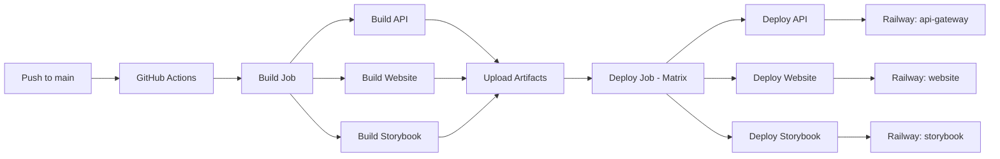

# Railway Deployment Without CLI

This guide shows how to deploy to Railway using **only** the dashboard and GitHub Actions - no local Railway CLI needed.

## Why No CLI?

- ✅ Simpler setup - no additional tools to install
- ✅ Works on any machine without configuration
- ✅ All deployments happen via GitHub Actions
- ✅ Better for team environments (everyone uses same workflow)

## Complete Setup (Dashboard + GitHub Actions Only)

### Step 1: Railway Dashboard Setup (3 minutes)

1. **Create Project**

   - Go to https://railway.app/dashboard
   - Click "New Project" → "Empty Project"
   - Name: `alanspurlock-profile` (or your preference)

2. **Create Services**

   Click "New" → "Empty Service" three times:

   | Service Name  | Root Directory     | Purpose            |
   | ------------- | ------------------ | ------------------ |
   | `api-gateway` | `apps/api-gateway` | NestJS API backend |
   | `website`     | `apps/frontend`    | React frontend     |
   | `storybook`   | `libs/spurlock-ui` | Component docs     |

3. **Configure Each Service**

   For each service:

   - Click service → Settings → General
   - Set "Root Directory" (see table above)
   - The `railway.json` files handle build/start commands

   **Service names must match exactly** (used in GitHub Actions):

   - ✅ `api-gateway` (lowercase with hyphen)
   - ❌ `API Gateway` or `api_gateway`

4. **Add Environment Variables** (Optional)

   For `api-gateway` service:

   - Click service → Variables tab
   - Add any needed env vars (database URLs, API keys, etc.)
   - `$PORT` is automatically provided by Railway

### Step 2: GitHub Secrets (2 minutes)

1. **Get Railway Token**

   - Railway → Account Settings → Tokens
   - Click "Create Token"
   - Name: "GitHub Actions"
   - Copy the token

2. **Add to GitHub**
   - GitHub repo → Settings → Secrets and variables → Actions
   - Click "New repository secret"
   - Name: `RAILWAY_TOKEN`
   - Value: (paste token)
   - Click "Add secret"

### Step 3: Deploy! (1 command)

```bash
# Install dependencies (includes 'serve' package for Railway)
pnpm install

# Commit and push
git add .
git commit -m "Configure Railway deployment"
git push origin main
```

That's it! GitHub Actions will:

1. ✅ Build all three projects
2. ✅ Deploy to Railway in parallel
3. ✅ Update all services automatically

## How It Works



### The GitHub Actions Workflow

From `.github/workflows/deploy-railway.yml`:

```yaml
# 1. Build everything once
build:
  - Install dependencies
  - Build all three projects
  - Upload artifacts

# 2. Deploy in parallel (matrix strategy)
deploy:
  strategy:
    matrix:
      - api-gateway
      - website
      - storybook
  steps:
    - Download artifacts
    - railway up --service {service}
```

**Key Benefits**:

- Builds once, deploys three times (efficient)
- Parallel deployments (fast)
- Consistent builds across all services
- No local Railway CLI needed

## Monitoring Deployments

### In GitHub

1. Go to Actions tab
2. Click "Deploy to Railway" workflow
3. Watch the build and deploy jobs

### In Railway

1. Go to your project
2. Each service shows deployment status
3. Click service → Deployments for logs
4. Click service → Settings for public URL

## Updating Your Application

Just push to main:

```bash
git add .
git commit -m "Update feature"
git push origin main
```

GitHub Actions automatically:

1. Detects what changed (path filtering)
2. Builds affected projects
3. Deploys to Railway

## Manual Deployments

Trigger from GitHub without pushing code:

1. GitHub → Actions
2. Select "Deploy to Railway"
3. Click "Run workflow"
4. Select branch → "Run workflow"

## Troubleshooting

### Deployment fails in GitHub Actions

**Check**:

1. `RAILWAY_TOKEN` secret is set in GitHub
2. Builds work locally:
   ```bash
   pnpm build:api
   pnpm build
   pnpm build:storybook
   ```
3. GitHub Actions logs for specific errors

### Service won't start in Railway

**Check**:

1. Railway service logs (click service → Deployments)
2. Root directory is set correctly
3. `railway.json` exists in service root directory
4. Environment variables are set (if needed)

### Service names don't match

**Error**: `railway up --service api-gateway` fails

**Fix**: Service name in Railway must exactly match workflow:

- Railway dashboard → Click service → Settings → Name
- Must be: `api-gateway`, `website`, `storybook` (exact match)

## Configuration Files

Each service has a `railway.json`:

**`apps/api-gateway/railway.json`**:

```json
{
  "build": {
    "buildCommand": "cd ../.. && pnpm install && pnpm build:api"
  },
  "deploy": {
    "startCommand": "node ../../dist/apps/api-gateway/main.js"
  }
}
```

**`apps/frontend/railway.json`**:

```json
{
  "build": {
    "buildCommand": "cd ../.. && pnpm install && pnpm build"
  },
  "deploy": {
    "startCommand": "npx serve ../../dist/apps/frontend -s -p $PORT"
  }
}
```

**`libs/spurlock-ui/railway.json`**:

```json
{
  "build": {
    "buildCommand": "cd ../.. && pnpm install && pnpm build:storybook"
  },
  "deploy": {
    "startCommand": "npx serve ../../dist/storybook/spurlock-ui -s -p $PORT"
  }
}
```

## Environment Variables

### Automatically Provided by Railway

- `$PORT` - The port your service should listen on
- `RAILWAY_ENVIRONMENT` - Current environment (production, staging, etc.)
- `RAILWAY_PROJECT_ID` - Your project ID
- `RAILWAY_SERVICE_ID` - Current service ID

### Custom Variables

Add in Railway dashboard:

1. Click service → Variables tab
2. Click "New Variable"
3. Enter name and value
4. Redeploy (happens automatically)

## Cost Optimization

Railway offers:

- Free tier: $5/month in credits
- Pay-as-you-go after credits exhausted

**Tips to save credits**:

1. Use path filtering (only deploy when files change) ✅ Already configured
2. Use build artifacts (don't rebuild multiple times) ✅ Already configured
3. Delete unused services
4. Use sleep mode for services not in active use

## Next Steps

Once deployed:

1. **Get Service URLs**

   - Railway → Click each service → Get domain
   - Use these URLs to connect services

2. **Update CORS** (if needed)

   - Update API's CORS to allow Railway website URL
   - In `apps/api-gateway/src/main.ts`:
     ```typescript
     app.enableCors({
       origin: [
         'https://your-railway-website.up.railway.app',
         // ... other origins
       ],
     });
     ```

3. **Custom Domains** (optional)

   - Railway → Service → Settings → Domains
   - Add custom domain
   - Update DNS records

4. **Monitor Performance**
   - Railway provides metrics for each service
   - Check CPU, memory, network usage

## Summary

**What you did**:

- ✅ Created Railway project in dashboard (no CLI)
- ✅ Set up three services with root directories
- ✅ Added Railway token to GitHub secrets
- ✅ Pushed to main

**What happens automatically**:

- ✅ GitHub Actions builds everything
- ✅ Three services deploy in parallel to Railway
- ✅ Railway runs your services on their infrastructure
- ✅ You get public URLs for each service

**No local Railway CLI needed at any point!** 🎉
